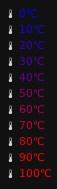

gradient-temp
=========
[][license]

A temperature indicator for [i3blocks], colored according to heat.



## Installation

#### Requirements
* awk (POSIX compatible)
* bc
* [i3blocks]

#### Optional
* fonts-font-awesome

### Command-line options
```
Usage: ./gradient-temp [options]
Display a temperature indicator using lm_sensors for i3blocks.

Options:
  -s			sensor to query
  -f			display temperatures in fahrenheit
  -G			disable color gradient
  -c <temp>		override critical temperature
  -m <temp>		override maximum temperature
  -h			display this help and exit
```

### Guide
Copy the blocklet configuration in the given `i3blocks.conf` into your [i3blocks] configuration file, the recommended config is:

```INI
[gradient-temp]
label=&#x1f321;
markup=pango
command=$SCRIPT_DIR/gradient-temp
interval=10
instance=__REPLACE_ME__

#FONT=FontAwesome
#GRADIENT=true
#FAHRENHEIT=false
#COLOR_TEMP=white
#COLOR_GRADIENT_START=#0000FF
#COLOR_GRADIENT_END=#FF0000
#SYMBOL_C=&#x2103;
#SYMBOL_F=&#x2109;
#OVERRIDE_CRIT_TEMP=90
#OVERRIDE_MAX_TEMP=100
```

Set the `instance` variable to the sensor to monitor, see `sensors -u`.

## Customization

The following can be set in your i3blocks.conf in newer versions if [i3blocks], in older versions (<= 1.4-4) you can customize using the program options. The following are configurable:

Variable | Type | Option | Description
------------ | ------------ | ------------- | -------------
FONT | string | -f &lt;font&gt; | Font for text and symbols
SENSOR | string | -s &lt;sensor&gt; | The sensor to read
GRADIENT | boolean | -G | Whether or not to use the color gradient
FAHRENHEIT | boolean | -H | Whether or not to use fahrenheit
COLOR_TEMP | string | -t &lt;color&gt; | Color of text when not using the color gradient
COLOR_GRADIENT_START | string | -S &lt;#color&gt; | Start color for gradient; Must be a hex triplet prefixed with #
COLOR_GRADIENT_END | string | -E &lt;#color&gt; | End color for gradient; Must be a hex triplet prefixed with #
SYMBOL_C | string | -C &lt;symbol&gt; | Symbol for celsius
SYMBOL_F | string | -F &lt;symbol&gt; | Symbol for fahrenheit
OVERRIDE_CRIT_TEMP | float | -c &lt;temp&gt; | Override critical temperature
OVERRIDE_MAX_TEMP | float | -m &lt;temp&gt; | Override maximum temperature

## License

`gradient-temp` is released under [GNU General Public License v2][license]

Copyright (C) 1989, 1991 Free Software Foundation, Inc.

[i3blocks]: https://vivien.github.io/i3blocks/
[license]: https://www.gnu.org/licenses/gpl-2.0.en.html
